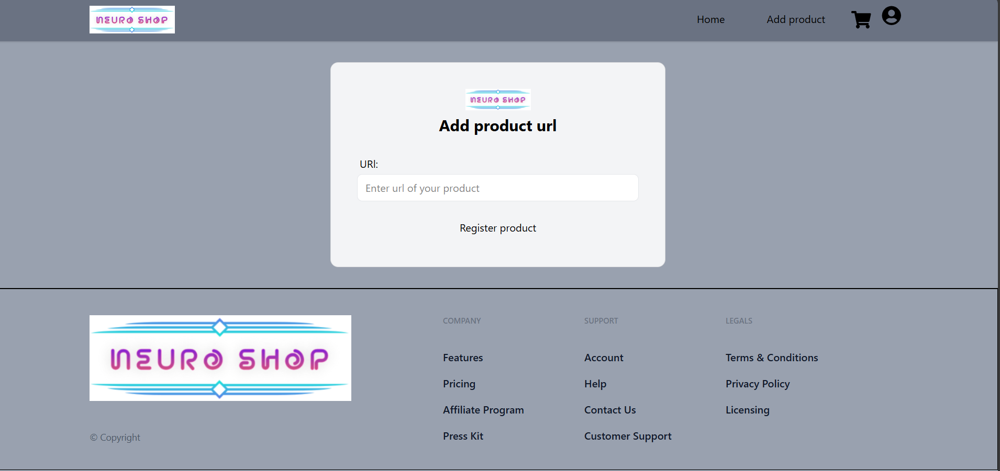
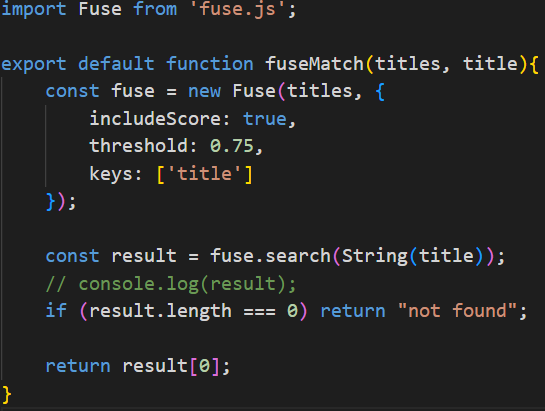
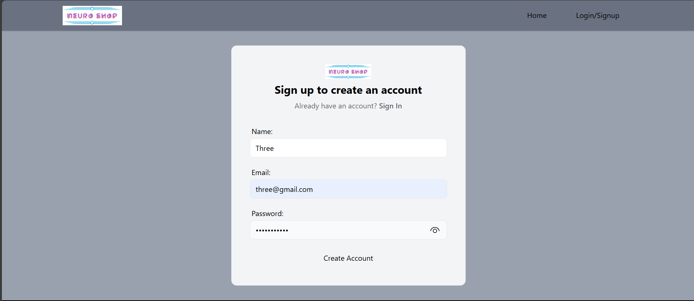
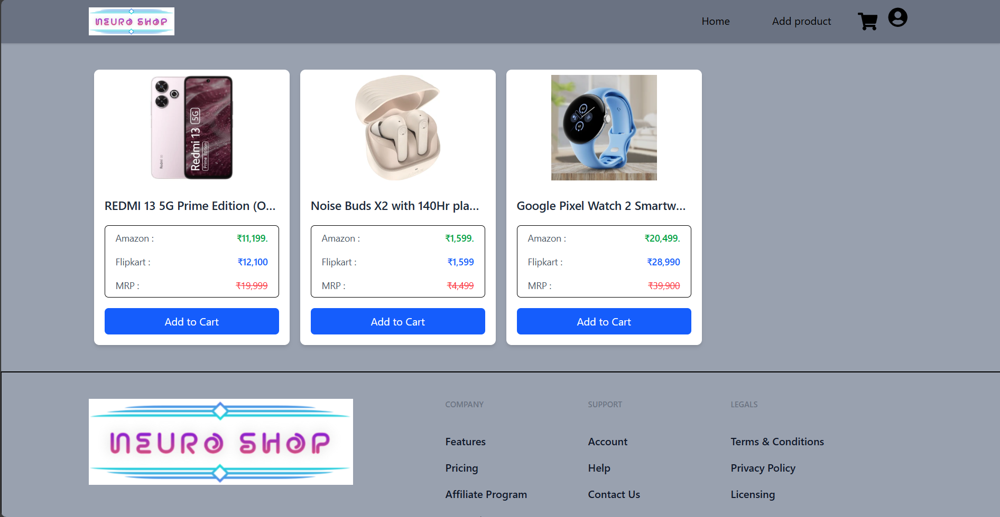
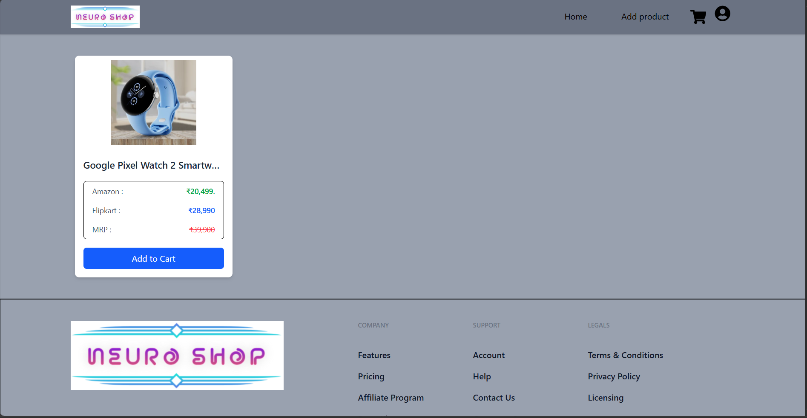

# 🛍️ NeuroShop: Intelligent Price Comparison Across E-Commerce Platforms

## 👤 Team
**Vishal**  
Third-year BTech Student  
NIT Srinagar   
Role: Full-stack Developer, Scraping Architect

---

## 🧩 Problem Statement

Online shoppers often waste time manually comparing prices across multiple e-commerce platforms. There’s no unified, real-time way to discover the best deal for a product across sites — especially when product names vary slightly or listings are inconsistent.

---

## 💡 Solution Overview

**NeuroShop** is a smart price comparison engine that takes a product URL from one of the e-commerce site, scrapes relevant product listings from multiple e-commerce platforms, matches similar items using fuzzy logic, and presents a clean, unified view of prices and details — helping users make faster, smarter buying decisions.

---

## 🚀 Key Features
- 🔗 Accepts a product URL from a supported e-commerce site

  
  
<em>User enters a product URL to initiate scraping</em>

- 🔍 Scrapes product data from multiple platforms using Puppeteer
- 🧠 Matches similar products using Fuse.js fuzzy matching

  
  
<em>Fuse.js configuration for threshold-based matching</em>

- 🛒 Displays unified product cards with price, title, and source
- ⚙️ Robust error handling and fallback scraping logic
- 🎨 Interactive UI with wishlist/cart logic and toast notifications
- 🔐 Secure authentication and session management with Appwrite
- 🗂️ Stores user data and product metadata in Appwrite's database
---

## 🛠️ Tech Stack

| Layer        | Tools Used                          |
|--------------|--------------------------------------|
| Frontend     | React-DOM, TailwindCSS               |
| Backend      | Appwrite (DB + Auth), Puppeteer      |
| Intelligence | Fuse.js (fuzzy matching)             |
| State & UI   | Redux, React Router |

---

## 🧪 Challenges Faced

- Matching products with inconsistent naming across platforms
- Ensuring session persistence and protected route stability
- Designing a clean, responsive UI under time constraints
- 🧩 Ensuring smooth data flow between scraping, matching, and rendering layers — including:
  - Coordinating async scraping results with UI updates
  - Preventing race conditions during login and session restore
  - Maintaining consistent state across Redux, Appwrite, and React components
---

## 📸 Demo to use NeuroShop

### 👤 Step 1: Create a User Account  
Sign up using your email to access personalized features like wishlist and session persistence.  

  
  
<em>Sign up form for new users</em>

---

### 🔗 Step 2: Paste a Product URL  
Go to the Add product page and enter a product link from Flipkart or Amazon   
(*other platforms are under development)   

  
  
<em>Product URL input form</em>

---

### 🧠 Step 3: Scraping and Matching  
NeuroShop scrapes similar listings and uses fuzzy matching to compare titles and specs.        

  
  
<em>Product scraping process</em>

---

### 🛒 Step 4: View Unified Product Cards  
See price comparisons, platform links, and add items to your wishlist or cart.  

  
  
<em>Home page for user</em>

---

Now this added product is also visible in the my products section

  
  
<em>User's my product page</em>

## 📽️ Demo Video

Watch NeuroShop in action:  
[Demo video link](https://drive.google.com/file/d/1AMp46BJ3VzZC-A3nkuSrIUK0aFa0lDUO/view?usp=sharing)

---

## 🌐 Live Demo

Sorry, I try many times but not able to deploy it successfully.

---

## 🔮 Future Scope

- Add autonomous decision-making (e.g. auto-buy when price drops)
- Expand to other domains/platforms: travel, books, services
- Integrate real-time alerts and user preferences
- Add browser extension for instant price comparison
- 🧾 Show detailed comparisons including:
  - Price breakdowns
  - Platform-specific offers and discounts
  - Delivery timelines and return policies
- Live price updates

---

## 🌟 Why NeuroShop Stands Out

- Real-world utility with immediate value
- Clean architecture and modular scraping logic
- Intelligent matching across platforms
- Scalable design for future automation

---

## 📬 Contact

**Vishal**  
Email: [eedo542363@outlook.com]  
GitHub: [github.com/Quid-Solo](https://github.com/Quid-Solo)

